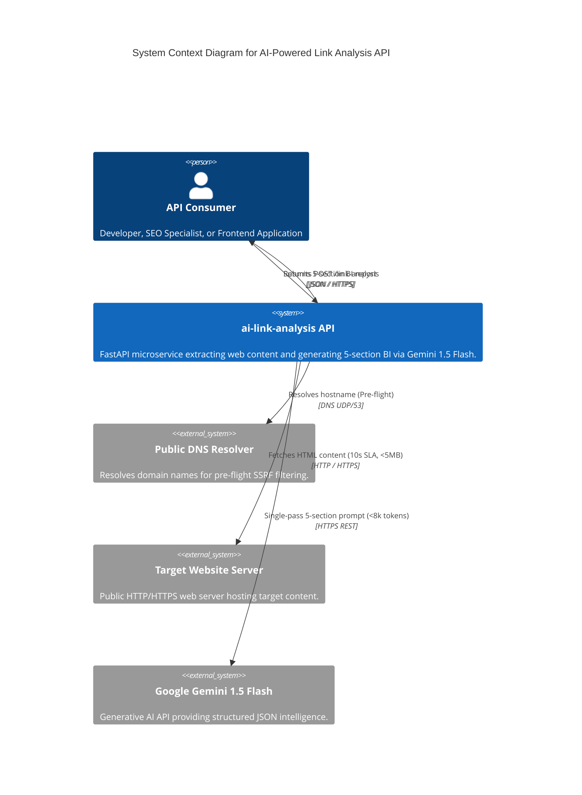

# UML 01: C4 System Context Diagram

```mermaid
C4Context
    title System Context Diagram for AI-Powered Link Analysis API

    Person(user, "API Consumer", "Developer, SEO Specialist, or Frontend Application")
    System(link_api, "ai-link-analysis API", "FastAPI microservice extracting web content and generating 5-section BI via Gemini 1.5 Flash.")
    System_Ext(dns, "Public DNS Resolver", "Resolves domain names for pre-flight SSRF filtering.")
    System_Ext(target_web, "Target Website Server", "Public HTTP/HTTPS web server hosting target content.")
    System_Ext(gemini, "Google Gemini 1.5 Flash", "Generative AI API providing structured JSON intelligence.")

    Rel(user, link_api, "Submits POST /link-analysis", "JSON / HTTPS")
    Rel(link_api, dns, "Resolves hostname (Pre-flight)", "DNS UDP/53")
    Rel(link_api, target_web, "Fetches HTML content (10s SLA, <5MB)", "HTTP / HTTPS")
    Rel(link_api, gemini, "Single-pass 5-section prompt (<8k tokens)", "HTTPS REST")
    Rel(link_api, user, "Returns 5-section BI report", "JSON / HTTPS")
```
