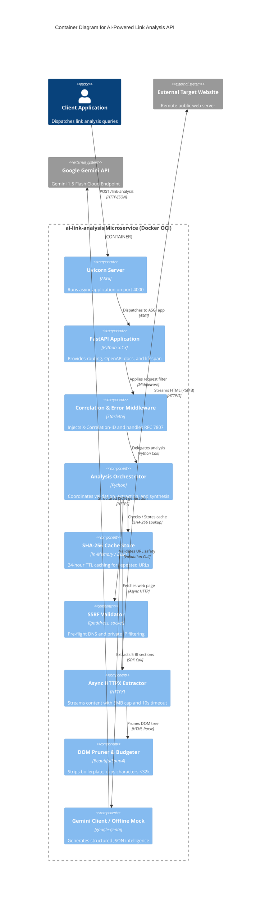

# UML 02: C4 Container Diagram

```mermaid
C4Container
    title Container Diagram for AI-Powered Link Analysis API

    Person(client, "Client Application", "Dispatches link analysis queries")

    Container_Boundary(c1, "ai-link-analysis Microservice (Docker OCI)") {
        Component(uvicorn, "Uvicorn Server", "ASGI", "Runs async application on port 4000")
        Component(fastapi, "FastAPI Application", "Python 3.13", "Provides routing, OpenAPI docs, and lifespan")
        Component(middleware, "Correlation & Error Middleware", "Starlette", "Injects X-Correlation-ID and handles RFC 7807")
        Component(orchestrator, "Analysis Orchestrator", "Python", "Coordinates validation, extraction, and synthesis")
        Component(cache, "SHA-256 Cache Store", "In-Memory / Disk", "24-hour TTL caching for repeated URLs")
        Component(ssrf, "SSRF Validator", "ipaddress, socket", "Pre-flight DNS and private IP filtering")
        Component(extractor, "Async HTTPX Extractor", "HTTPX", "Streams content with 5MB cap and 10s timeout")
        Component(pruner, "DOM Pruner & Budgeter", "BeautifulSoup4", "Strips boilerplate, caps characters <32k")
        Component(gemini_client, "Gemini Client / Offline Mock", "google-genai", "Generates structured JSON intelligence")
    }

    System_Ext(web_server, "External Target Website", "Remote public web server")
    System_Ext(gemini_api, "Google Gemini API", "Gemini 1.5 Flash Cloud Endpoint")

    Rel(client, uvicorn, "POST /link-analysis", "HTTP/JSON")
    Rel(uvicorn, fastapi, "Dispatches to ASGI app", "ASGI")
    Rel(fastapi, middleware, "Applies request filter", "Middleware")
    Rel(middleware, orchestrator, "Delegates analysis", "Python Call")
    Rel(orchestrator, cache, "Checks / Stores cache", "SHA-256 Lookup")
    Rel(orchestrator, ssrf, "Validates URL safety", "Validation Call")
    Rel(orchestrator, extractor, "Fetches web page", "Async HTTP")
    Rel(extractor, web_server, "Streams HTML (<5MB)", "HTTP/S")
    Rel(extractor, pruner, "Prunes DOM tree", "HTML Parse")
    Rel(orchestrator, gemini_client, "Extracts 5 BI sections", "SDK Call")
    Rel(gemini_client, gemini_api, "Structured JSON generation", "HTTPS")
```
