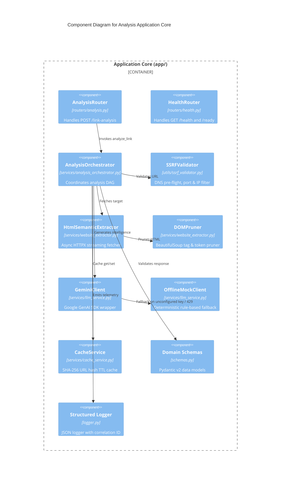

# UML 03: C4 Component Diagram

```mermaid
C4Component
    title Component Diagram for Analysis Application Core

    Container_Boundary(app, "Application Core (app/)") {
        Component(router_analysis, "AnalysisRouter", "routers/analysis.py", "Handles POST /link-analysis")
        Component(router_health, "HealthRouter", "routers/health.py", "Handles GET /health and /ready")
        Component(orchestrator, "AnalysisOrchestrator", "services/analysis_orchestrator.py", "Coordinates analysis DAG")
        Component(ssrf_validator, "SSRFValidator", "utils/ssrf_validator.py", "DNS pre-flight, port & IP filter")
        Component(extractor, "HtmlSemanticExtractor", "services/website_extractor.py", "Async HTTPX streaming fetcher")
        Component(pruner, "DOMPruner", "services/website_extractor.py", "BeautifulSoup tag & token pruner")
        Component(llm_service, "GeminiClient", "services/llm_service.py", "Google GenAI SDK wrapper")
        Component(mock_client, "OfflineMockClient", "services/llm_service.py", "Deterministic rule-based fallback")
        Component(cache_service, "CacheService", "services/cache_service.py", "SHA-256 URL hash TTL cache")
        Component(schemas, "Domain Schemas", "schemas.py", "Pydantic v2 data models")
        Component(logger, "Structured Logger", "logger.py", "JSON logger with correlation ID")
    }

    Rel(router_analysis, orchestrator, "Invokes analyze_link")
    Rel(orchestrator, cache_service, "Cache get/set")
    Rel(orchestrator, ssrf_validator, "Validates URL")
    Rel(orchestrator, extractor, "Fetches target")
    Rel(extractor, pruner, "Prunes HTML")
    Rel(orchestrator, llm_service, "Generates intelligence")
    Rel(llm_service, mock_client, "Fallback on unconfigured key / 429")
    Rel(orchestrator, schemas, "Validates response")
    Rel(orchestrator, logger, "Emits telemetry")
```
