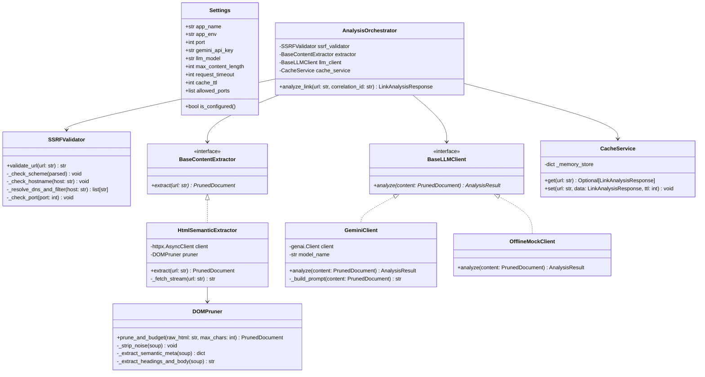

# UML 04: Class Diagram

```mermaid
classDiagram
    class Settings {
        +str app_name
        +str app_env
        +int port
        +str gemini_api_key
        +str llm_model
        +int max_content_length
        +int request_timeout
        +int cache_ttl
        +list allowed_ports
        +bool is_configured()
    }

    class SSRFValidator {
        +validate_url(url: str) str
        -_check_scheme(parsed) void
        -_check_hostname(host: str) void
        -_resolve_dns_and_filter(host: str) list[str]
        -_check_port(port: int) void
    }

    class BaseContentExtractor {
        <<interface>>
        +extract(url: str) PrunedDocument*
    }

    class HtmlSemanticExtractor {
        -httpx.AsyncClient client
        -DOMPruner pruner
        +extract(url: str) PrunedDocument
        -_fetch_stream(url: str) str
    }

    class DOMPruner {
        +prune_and_budget(raw_html: str, max_chars: int) PrunedDocument
        -_strip_noise(soup) void
        -_extract_semantic_meta(soup) dict
        -_extract_headings_and_body(soup) str
    }

    class BaseLLMClient {
        <<interface>>
        +analyze(content: PrunedDocument) AnalysisResult*
    }

    class GeminiClient {
        -genai.Client client
        -str model_name
        +analyze(content: PrunedDocument) AnalysisResult
        -_build_prompt(content: PrunedDocument) str
    }

    class OfflineMockClient {
        +analyze(content: PrunedDocument) AnalysisResult
    }

    class AnalysisOrchestrator {
        -SSRFValidator ssrf_validator
        -BaseContentExtractor extractor
        -BaseLLMClient llm_client
        -CacheService cache_service
        +analyze_link(url: str, correlation_id: str) LinkAnalysisResponse
    }

    class CacheService {
        -dict _memory_store
        +get(url: str) Optional[LinkAnalysisResponse]
        +set(url: str, data: LinkAnalysisResponse, ttl: int) void
    }

    BaseContentExtractor <|.. HtmlSemanticExtractor
    HtmlSemanticExtractor --> DOMPruner
    BaseLLMClient <|.. GeminiClient
    BaseLLMClient <|.. OfflineMockClient
    AnalysisOrchestrator --> SSRFValidator
    AnalysisOrchestrator --> BaseContentExtractor
    AnalysisOrchestrator --> BaseLLMClient
    AnalysisOrchestrator --> CacheService
```
