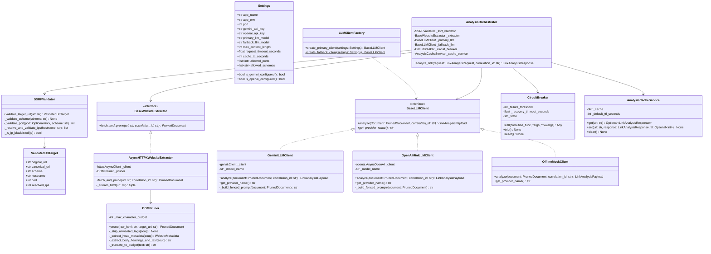

# UML 04: Class Diagram

```mermaid
classDiagram
    class Settings {
        +str app_name
        +str app_env
        +int port
        +str gemini_api_key
        +str openai_api_key
        +str primary_llm_model
        +str fallback_llm_model
        +int max_content_length
        +float request_timeout_seconds
        +int cache_ttl_seconds
        +list~int~ allowed_ports
        +list~str~ allowed_schemes
        +bool is_gemini_configured() bool
        +bool is_openai_configured() bool
    }

    class ValidatedUrlTarget {
        +str original_url
        +str canonical_url
        +str scheme
        +str hostname
        +int port
        +list resolved_ips
    }

    class SSRFValidator {
        +validate_target_url(url: str) ValidatedUrlTarget
        -_validate_scheme(scheme: str) None
        -_validate_port(port: Optional~int~, scheme: str) int
        -_resolve_and_validate_ips(hostname: str) list
        -_is_ip_blacklisted(ip) bool
    }

    class BaseWebsiteExtractor {
        <<interface>>
        +fetch_and_prune(url: str, correlation_id: str) PrunedDocument*
    }

    class AsyncHTTPXWebsiteExtractor {
        -httpx.AsyncClient _client
        -DOMPruner _pruner
        +fetch_and_prune(url: str, correlation_id: str) PrunedDocument
        -_stream_html(url: str) tuple
    }

    class DOMPruner {
        -int _max_character_budget
        +prune(raw_html: str, target_url: str) PrunedDocument
        -_strip_unwanted_tags(soup) None
        -_extract_head_metadata(soup) WebsiteMetadata
        -_extract_body_headings_and_text(soup) str
        -_truncate_to_budget(text: str) str
    }

    class BaseLLMClient {
        <<interface>>
        +analyze(document: PrunedDocument, correlation_id: str) LinkAnalysisPayload*
        +get_provider_name() str*
    }

    class GeminiLLMClient {
        -genai.Client _client
        -str _model_name
        +analyze(document: PrunedDocument, correlation_id: str) LinkAnalysisPayload
        +get_provider_name() str
        -_build_fenced_prompt(document: PrunedDocument) str
    }

    class OpenAIMiniLLMClient {
        -openai.AsyncOpenAI _client
        -str _model_name
        +analyze(document: PrunedDocument, correlation_id: str) LinkAnalysisPayload
        +get_provider_name() str
        -_build_fenced_prompt(document: PrunedDocument) str
    }

    class OfflineMockClient {
        +analyze(document: PrunedDocument, correlation_id: str) LinkAnalysisPayload
        +get_provider_name() str
    }

    class LLMClientFactory {
        +create_primary_client(settings: Settings) BaseLLMClient$
        +create_fallback_client(settings: Settings) BaseLLMClient$
    }

    class CircuitBreaker {
        -int _failure_threshold
        -float _recovery_timeout_seconds
        -str _state
        +call(coroutine_func, *args, **kwargs) Any
        +trip() None
        +reset() None
    }

    class AnalysisCacheService {
        -dict _cache
        -int _default_ttl_seconds
        +get(url: str) Optional~LinkAnalysisResponse~
        +set(url: str, response: LinkAnalysisResponse, ttl: Optional~int~) None
        +clear() None
    }

    class AnalysisOrchestrator {
        -SSRFValidator _ssrf_validator
        -BaseWebsiteExtractor _extractor
        -BaseLLMClient _primary_llm
        -BaseLLMClient _fallback_llm
        -CircuitBreaker _circuit_breaker
        -AnalysisCacheService _cache_service
        +analyze_link(request: LinkAnalysisRequest, correlation_id: str) LinkAnalysisResponse
    }

    BaseWebsiteExtractor <|.. AsyncHTTPXWebsiteExtractor
    AsyncHTTPXWebsiteExtractor --> DOMPruner
    BaseLLMClient <|.. GeminiLLMClient
    BaseLLMClient <|.. OpenAIMiniLLMClient
    BaseLLMClient <|.. OfflineMockClient
    LLMClientFactory ..> BaseLLMClient
    AnalysisOrchestrator --> SSRFValidator
    AnalysisOrchestrator --> BaseWebsiteExtractor
    AnalysisOrchestrator --> BaseLLMClient
    AnalysisOrchestrator --> CircuitBreaker
    AnalysisOrchestrator --> AnalysisCacheService
    SSRFValidator ..> ValidatedUrlTarget
```
