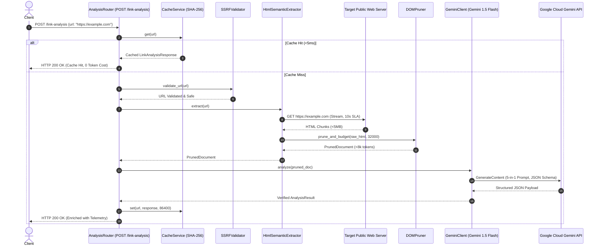

# UML 05: Sequence Diagram - Link Analysis Workflow

```mermaid
sequenceDiagram
    autonumber
    actor Client
    participant Router as AnalysisRouter (POST /link-analysis)
    participant Cache as CacheService (SHA-256)
    participant SSRF as SSRFValidator
    participant Extractor as HtmlSemanticExtractor
    participant Web as Target Public Web Server
    participant Pruner as DOMPruner
    participant LLM as GeminiClient (Gemini 1.5 Flash)
    participant API as Google Cloud Gemini API

    Client->>Router: POST /link-analysis {url: "https://example.com"}
    Router->>Cache: get(url)
    alt Cache Hit (<5ms)
        Cache-->>Router: Cached LinkAnalysisResponse
        Router-->>Client: HTTP 200 OK (Cache Hit, 0 Token Cost)
    else Cache Miss
        Router->>SSRF: validate_url(url)
        SSRF-->>Router: URL Validated & Safe
        Router->>Extractor: extract(url)
        Extractor->>Web: GET https://example.com (Stream, 10s SLA)
        Web-->>Extractor: HTML Chunks (<5MB)
        Extractor->>Pruner: prune_and_budget(raw_html, 32000)
        Pruner-->>Extractor: PrunedDocument (<8k tokens)
        Extractor-->>Router: PrunedDocument
        Router->>LLM: analyze(pruned_doc)
        LLM->>API: GenerateContent (5-in-1 Prompt, JSON Schema)
        API-->>LLM: Structured JSON Payload
        LLM-->>Router: Verified AnalysisResult
        Router->>Cache: set(url, response, 86400)
        Router-->>Client: HTTP 200 OK (Enriched with Telemetry)
    end
```
