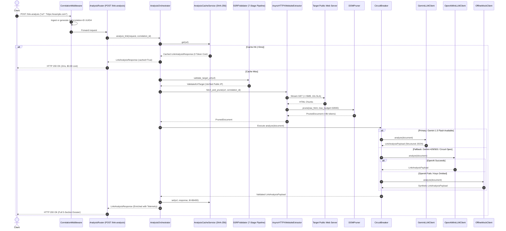

# UML 05: Sequence Diagram - Link Analysis End-to-End Workflow

```mermaid
sequenceDiagram
    autonumber
    actor Client
    participant MW as CorrelationMiddleware
    participant Router as AnalysisRouter (POST /link-analysis)
    participant Orch as AnalysisOrchestrator
    participant Cache as AnalysisCacheService (SHA-256)
    participant SSRF as SSRFValidator (7-Stage Pipeline)
    participant Extractor as AsyncHTTPXWebsiteExtractor
    participant Web as Target Public Web Server
    participant Pruner as DOMPruner
    participant CB as CircuitBreaker
    participant Gemini as GeminiLLMClient
    participant OpenAI as OpenAIMiniLLMClient
    participant Mock as OfflineMockClient

    Client->>MW: POST /link-analysis {"url": "https://example.com"}
    MW->>MW: Ingest or generate X-Correlation-ID UUID4
    MW->>Router: Forward request
    Router->>Orch: analyze_link(request, correlation_id)
    Orch->>Cache: get(url)
    
    alt Cache Hit (<5ms)
        Cache-->>Orch: Cached LinkAnalysisResponse (0 Token Cost)
        Orch-->>Router: LinkAnalysisResponse (cached=True)
        Router-->>Client: HTTP 200 OK (2ms, $0.00 cost)
    else Cache Miss
        Orch->>SSRF: validate_target_url(url)
        SSRF-->>Orch: ValidatedUrlTarget (Verified Public IP)
        Orch->>Extractor: fetch_and_prune(url, correlation_id)
        Extractor->>Web: Stream GET (<=5MB, 10s SLA)
        Web-->>Extractor: HTML Chunks
        Extractor->>Pruner: prune(raw_html, max_budget=32000)
        Pruner-->>Extractor: PrunedDocument (<8k tokens)
        Extractor-->>Orch: PrunedDocument
        
        Orch->>CB: Execute analyze(document)
        alt Primary: Gemini 1.5 Flash Available
            CB->>Gemini: analyze(document)
            Gemini-->>CB: LinkAnalysisPayload (Structured JSON)
        else Fallback: Gemini 429/503 / Circuit Open
            CB->>OpenAI: analyze(document)
            alt OpenAI Succeeds
                OpenAI-->>CB: LinkAnalysisPayload
            else OpenAI Fails / Keys Omitted
                CB->>Mock: analyze(document)
                Mock-->>CB: Synthetic LinkAnalysisPayload
            end
        end
        CB-->>Orch: Validated LinkAnalysisPayload
        
        Orch->>Cache: set(url, response, ttl=86400)
        Orch-->>Router: LinkAnalysisResponse (Enriched with Telemetry)
        Router-->>Client: HTTP 200 OK (Full 5-Section Dossier)
    end
```
