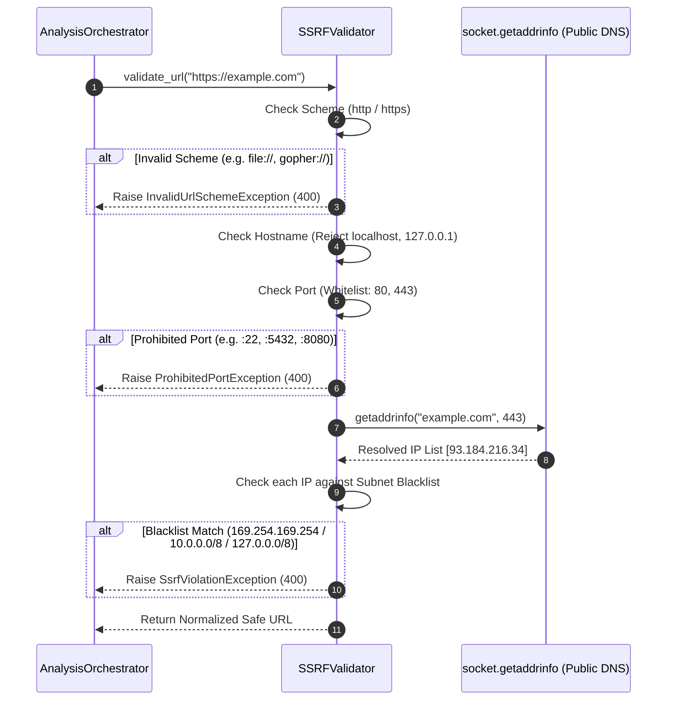

# UML 06: Sequence Diagram - Zero-Trust SSRF Validation

```mermaid
sequenceDiagram
    autonumber
    participant Caller as AnalysisOrchestrator
    participant Validator as SSRFValidator
    participant DNS as socket.getaddrinfo (Public DNS)

    Caller->>Validator: validate_url("https://example.com")
    Validator->>Validator: Check Scheme (http / https)
    alt Invalid Scheme (e.g. file://, gopher://)
        Validator-->>Caller: Raise InvalidUrlSchemeException (400)
    end
    Validator->>Validator: Check Hostname (Reject localhost, 127.0.0.1)
    Validator->>Validator: Check Port (Whitelist: 80, 443)
    alt Prohibited Port (e.g. :22, :5432, :8080)
        Validator-->>Caller: Raise ProhibitedPortException (400)
    end
    Validator->>DNS: getaddrinfo("example.com", 443)
    DNS-->>Validator: Resolved IP List [93.184.216.34]
    Validator->>Validator: Check each IP against Subnet Blacklist
    alt Blacklist Match (169.254.169.254 / 10.0.0.0/8 / 127.0.0.0/8)
        Validator-->>Caller: Raise SsrfViolationException (400)
    end
    Validator-->>Caller: Return Normalized Safe URL
```
