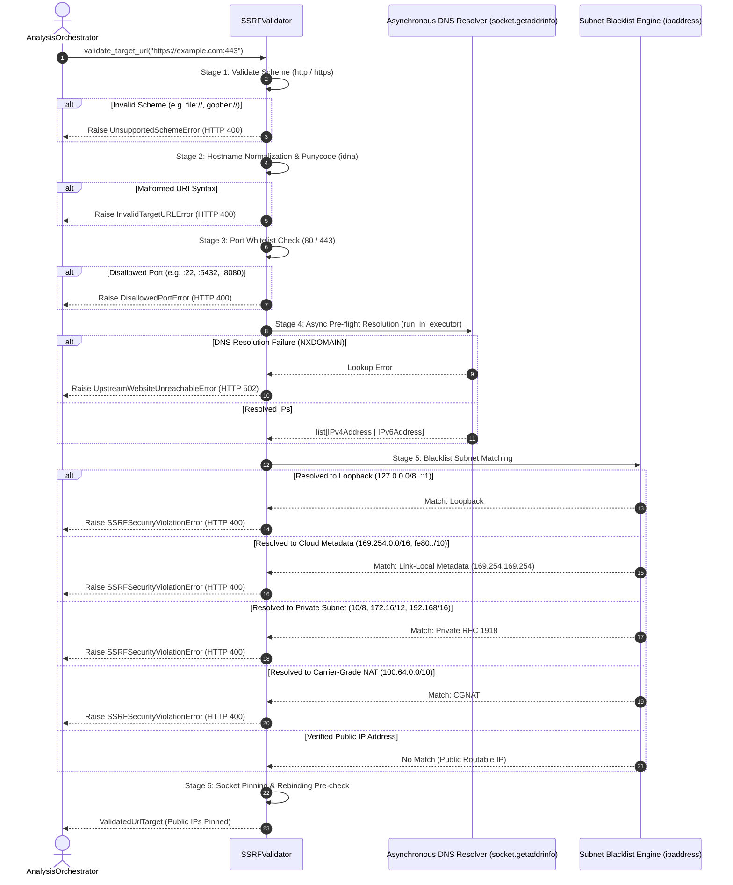

# UML 06: Sequence Diagram - 7-Stage Zero-Trust SSRF Validation

```mermaid
sequenceDiagram
    autonumber
    actor Orch as AnalysisOrchestrator
    participant SSRF as SSRFValidator
    participant DNS as Asynchronous DNS Resolver (socket.getaddrinfo)
    participant CIDR as Subnet Blacklist Engine (ipaddress)

    Orch->>SSRF: validate_target_url("https://example.com:443")
    
    SSRF->>SSRF: Stage 1: Validate Scheme (http / https)
    alt Invalid Scheme (e.g. file://, gopher://)
        SSRF-->>Orch: Raise UnsupportedSchemeError (HTTP 400)
    end
    
    SSRF->>SSRF: Stage 2: Hostname Normalization & Punycode (idna)
    alt Malformed URI Syntax
        SSRF-->>Orch: Raise InvalidTargetURLError (HTTP 400)
    end
    
    SSRF->>SSRF: Stage 3: Port Whitelist Check (80 / 443)
    alt Disallowed Port (e.g. :22, :5432, :8080)
        SSRF-->>Orch: Raise DisallowedPortError (HTTP 400)
    end
    
    SSRF->>DNS: Stage 4: Async Pre-flight Resolution (run_in_executor)
    alt DNS Resolution Failure (NXDOMAIN)
        DNS-->>SSRF: Lookup Error
        SSRF-->>Orch: Raise UpstreamWebsiteUnreachableError (HTTP 502)
    else Resolved IPs
        DNS-->>SSRF: list[IPv4Address | IPv6Address]
    end
    
    SSRF->>CIDR: Stage 5: Blacklist Subnet Matching
    alt Resolved to Loopback (127.0.0.0/8, ::1)
        CIDR-->>SSRF: Match: Loopback
        SSRF-->>Orch: Raise SSRFSecurityViolationError (HTTP 400)
    else Resolved to Cloud Metadata (169.254.0.0/16, fe80::/10)
        CIDR-->>SSRF: Match: Link-Local Metadata (169.254.169.254)
        SSRF-->>Orch: Raise SSRFSecurityViolationError (HTTP 400)
    else Resolved to Private Subnet (10/8, 172.16/12, 192.168/16)
        CIDR-->>SSRF: Match: Private RFC 1918
        SSRF-->>Orch: Raise SSRFSecurityViolationError (HTTP 400)
    else Resolved to Carrier-Grade NAT (100.64.0.0/10)
        CIDR-->>SSRF: Match: CGNAT
        SSRF-->>Orch: Raise SSRFSecurityViolationError (HTTP 400)
    else Verified Public IP Address
        CIDR-->>SSRF: No Match (Public Routable IP)
    end
    
    SSRF->>SSRF: Stage 6: Socket Pinning & Rebinding Pre-check
    SSRF-->>Orch: ValidatedUrlTarget (Public IPs Pinned)
```
