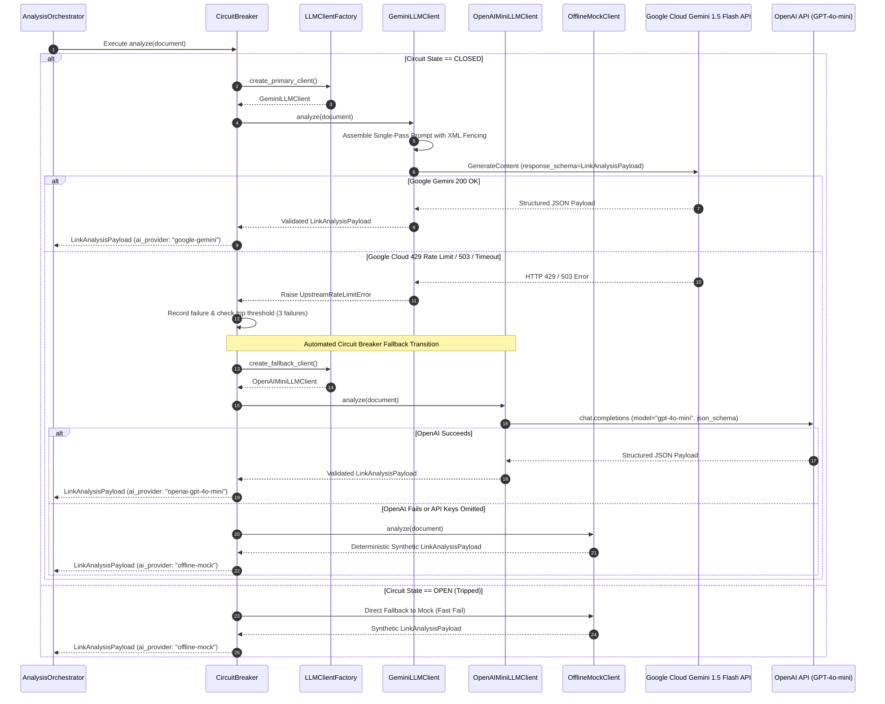

# UML 07: Sequence Diagram - LLM Intelligence Synthesis & Circuit Breaker

```mermaid
sequenceDiagram
    autonumber
    participant Orch as AnalysisOrchestrator
    participant CB as CircuitBreaker
    participant Factory as LLMClientFactory
    participant Gemini as GeminiLLMClient
    participant OpenAI as OpenAIMiniLLMClient
    participant Mock as OfflineMockClient
    participant GoogleCloud as Google Cloud Gemini 1.5 Flash API
    participant OpenAICloud as OpenAI API (GPT-4o-mini)

    Orch->>CB: Execute analyze(document)
    
    alt Circuit State == CLOSED
        CB->>Factory: create_primary_client()
        Factory-->>CB: GeminiLLMClient
        CB->>Gemini: analyze(document)
        Gemini->>Gemini: Assemble Single-Pass Prompt with XML Fencing
        Gemini->>GoogleCloud: GenerateContent (response_schema=LinkAnalysisPayload)
        
        alt Google Gemini 200 OK
            GoogleCloud-->>Gemini: Structured JSON Payload
            Gemini-->>CB: Validated LinkAnalysisPayload
            CB-->>Orch: LinkAnalysisPayload (ai_provider: "google-gemini")
        else Google Cloud 429 Rate Limit / 503 / Timeout
            GoogleCloud-->>Gemini: HTTP 429 / 503 Error
            Gemini-->>CB: Raise UpstreamRateLimitError
            CB->>CB: Record failure & check trip threshold (3 failures)
            
            Note over CB,OpenAI: Automated Circuit Breaker Fallback Transition
            CB->>Factory: create_fallback_client()
            Factory-->>CB: OpenAIMiniLLMClient
            CB->>OpenAI: analyze(document)
            OpenAI->>OpenAICloud: chat.completions (model="gpt-4o-mini", json_schema)
            
            alt OpenAI Succeeds
                OpenAICloud-->>OpenAI: Structured JSON Payload
                OpenAI-->>CB: Validated LinkAnalysisPayload
                CB-->>Orch: LinkAnalysisPayload (ai_provider: "openai-gpt-4o-mini")
            else OpenAI Fails or API Keys Omitted
                CB->>Mock: analyze(document)
                Mock-->>CB: Deterministic Synthetic LinkAnalysisPayload
                CB-->>Orch: LinkAnalysisPayload (ai_provider: "offline-mock")
            end
        end
    else Circuit State == OPEN (Tripped)
        CB->>Mock: Direct Fallback to Mock (Fast Fail)
        Mock-->>CB: Synthetic LinkAnalysisPayload
        CB-->>Orch: LinkAnalysisPayload (ai_provider: "offline-mock")
    end
```
