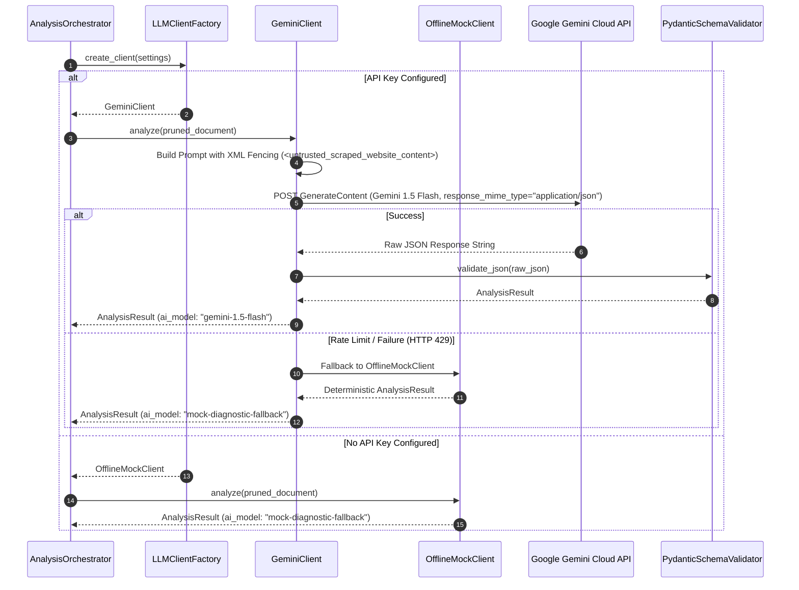

# UML 07: Sequence Diagram - LLM Intelligence Extraction

```mermaid
sequenceDiagram
    autonumber
    participant Orch as AnalysisOrchestrator
    participant Factory as LLMClientFactory
    participant Gemini as GeminiClient
    participant Mock as OfflineMockClient
    participant Cloud as Google Gemini Cloud API
    participant Validator as PydanticSchemaValidator

    Orch->>Factory: create_client(settings)
    alt API Key Configured
        Factory-->>Orch: GeminiClient
        Orch->>Gemini: analyze(pruned_document)
        Gemini->>Gemini: Build Prompt with XML Fencing (<untrusted_scraped_website_content>)
        Gemini->>Cloud: POST GenerateContent (Gemini 1.5 Flash, response_mime_type="application/json")
        alt Success
            Cloud-->>Gemini: Raw JSON Response String
            Gemini->>Validator: validate_json(raw_json)
            Validator-->>Gemini: AnalysisResult
            Gemini-->>Orch: AnalysisResult (ai_model: "gemini-1.5-flash")
        else Rate Limit / Failure (HTTP 429)
            Gemini->>Mock: Fallback to OfflineMockClient
            Mock-->>Gemini: Deterministic AnalysisResult
            Gemini-->>Orch: AnalysisResult (ai_model: "mock-diagnostic-fallback")
        end
    else No API Key Configured
        Factory-->>Orch: OfflineMockClient
        Orch->>Mock: analyze(pruned_document)
        Mock-->>Orch: AnalysisResult (ai_model: "mock-diagnostic-fallback")
    end
```
