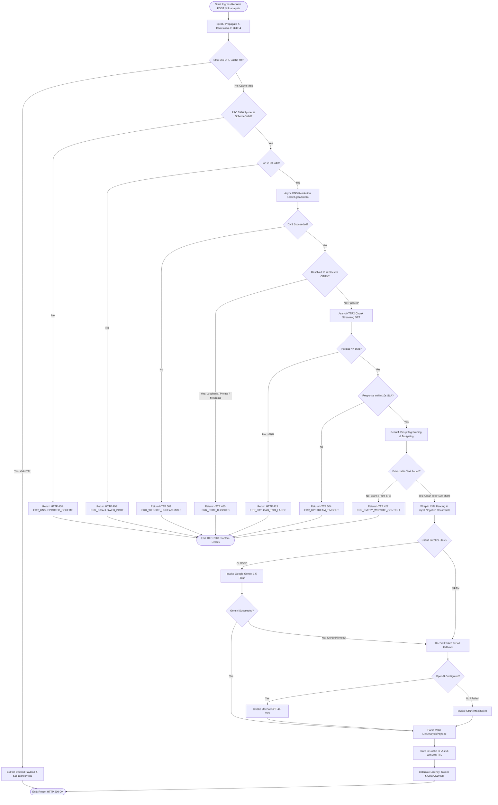

# UML 08: Activity Diagram - Master Analysis Orchestrator Workflow

```mermaid
flowchart TD
    Start([Start: Ingress Request POST /link-analysis]) --> InjectCID[Inject / Propagate X-Correlation-ID UUID4]
    InjectCID --> CheckCache{SHA-256 URL Cache Hit?}
    
    CheckCache -->|Yes: Valid TTL| BuildCachedResp[Extract Cached Payload & Set cached=true]
    BuildCachedResp --> ReturnSuccess([End: Return HTTP 200 OK])
    
    CheckCache -->|No: Cache Miss| ValidateSyntax{RFC 3986 Syntax & Scheme Valid?}
    ValidateSyntax -->|No| ErrSyntax[Return HTTP 400 ERR_UNSUPPORTED_SCHEME]
    ErrSyntax --> ReturnError([End: RFC 7807 Problem Details])
    
    ValidateSyntax -->|Yes| CheckPort{Port in 80, 443?}
    CheckPort -->|No| ErrPort[Return HTTP 400 ERR_DISALLOWED_PORT]
    ErrPort --> ReturnError
    
    CheckPort -->|Yes| ResolveDNS[Async DNS Resolution socket.getaddrinfo]
    ResolveDNS --> CheckDNS{DNS Succeeded?}
    CheckDNS -->|No| ErrDNS[Return HTTP 502 ERR_WEBSITE_UNREACHABLE]
    ErrDNS --> ReturnError
    
    CheckDNS -->|Yes| FilterSubnet{Resolved IP in Blacklist CIDRs?}
    FilterSubnet -->|Yes: Loopback / Private / Metadata| ErrSSRF[Return HTTP 400 ERR_SSRF_BLOCKED]
    ErrSSRF --> ReturnError
    
    FilterSubnet -->|No: Public IP| StreamHTML[Async HTTPX Chunk Streaming GET]
    StreamHTML --> CheckSize{Payload <= 5MB?}
    CheckSize -->|No: >5MB| ErrSize[Return HTTP 413 ERR_PAYLOAD_TOO_LARGE]
    ErrSize --> ReturnError
    
    CheckSize -->|Yes| CheckTimeout{Response within 10s SLA?}
    CheckTimeout -->|No| ErrTimeout[Return HTTP 504 ERR_UPSTREAM_TIMEOUT]
    ErrTimeout --> ReturnError
    
    CheckTimeout -->|Yes| PruneDOM[BeautifulSoup Tag Pruning & Budgeting]
    PruneDOM --> CheckText{Extractable Text Found?}
    CheckText -->|No: Blank / Pure SPA| ErrBlank[Return HTTP 422 ERR_EMPTY_WEBSITE_CONTENT]
    ErrBlank --> ReturnError
    
    CheckText -->|Yes: Clean Text <32k chars| BuildPrompt[Wrap in XML Fencing & Inject Negative Constraints]
    BuildPrompt --> CheckCB{Circuit Breaker State?}
    
    CheckCB -->|CLOSED| CallGemini[Invoke Google Gemini 1.5 Flash]
    CallGemini --> CheckGemini{Gemini Succeeded?}
    
    CheckGemini -->|Yes| ValidPayload[Parse Valid LinkAnalysisPayload]
    CheckGemini -->|No: 429/503/Timeout| TripCB[Record Failure & Call Fallback]
    
    CheckCB -->|OPEN| TripCB
    TripCB --> CallOpenAI{OpenAI Configured?}
    CallOpenAI -->|Yes| InvokeOpenAI[Invoke OpenAI GPT-4o-mini]
    InvokeOpenAI --> ValidPayload
    CallOpenAI -->|No / Failed| InvokeMock[Invoke OfflineMockClient]
    InvokeMock --> ValidPayload
    
    ValidPayload --> StoreCache[Store in Cache SHA-256 with 24h TTL]
    StoreCache --> EnrichTelemetry[Calculate Latency, Tokens & Cost USD/INR]
    EnrichTelemetry --> ReturnSuccess
```
