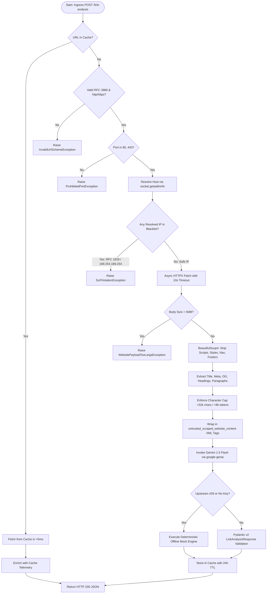

# UML 08: Activity Diagram - Analysis Orchestrator DAG

```mermaid
flowchart TD
    Start([Start: Ingress POST /link-analysis]) --> CheckCache{"URL in Cache?"}
    CheckCache -->|Yes| Hit[Fetch from Cache in <5ms]
    Hit --> EnrichTelemetry[Enrich with Cache Telemetry]
    EnrichTelemetry --> Return[Return HTTP 200 JSON]

    CheckCache -->|No| ValidateFormat{"Valid RFC 3986 & http/https?"}
    ValidateFormat -->|No| ErrScheme[Raise InvalidUrlSchemeException]
    ValidateFormat -->|Yes| ValidatePort{"Port in 80, 443?"}
    ValidatePort -->|No| ErrPort[Raise ProhibitedPortException]
    ValidatePort -->|Yes| ResolveDNS[Resolve Host via socket.getaddrinfo]
    ResolveDNS --> CheckBlacklist{"Any Resolved IP in Blacklist?"}
    CheckBlacklist -->|Yes: RFC 1918 / 169.254.169.254| ErrSSRF[Raise SsrfViolationException]
    CheckBlacklist -->|No: Safe IP| StreamFetch[Async HTTPX Fetch with 10s Timeout]

    StreamFetch --> CheckSize{"Body Size > 5MB?"}
    CheckSize -->|Yes| ErrSize[Raise WebsitePayloadTooLargeException]
    CheckSize -->|No| PruneDOM[BeautifulSoup4: Strip Scripts, Styles, Nav, Footers]

    PruneDOM --> ExtractMeta[Extract Title, Meta, OG, Headings, Paragraphs]
    ExtractMeta --> CapBudget[Enforce Character Cap <32k chars / <8k tokens]
    CapBudget --> FencePrompt[Wrap in untrusted_scraped_website_content XML Tags]

    FencePrompt --> CallLLM[Invoke Gemini 1.5 Flash via google-genai]
    CallLLM --> CheckRateLimit{"Upstream 429 or No Key?"}
    CheckRateLimit -->|Yes| FallbackMock[Execute Deterministic Offline Mock Engine]
    CheckRateLimit -->|No| ParseSchema[Pydantic v2 LinkAnalysisResponse Validation]

    FallbackMock --> StoreCache[Store in Cache with 24h TTL]
    ParseSchema --> StoreCache
    StoreCache --> Return
```
