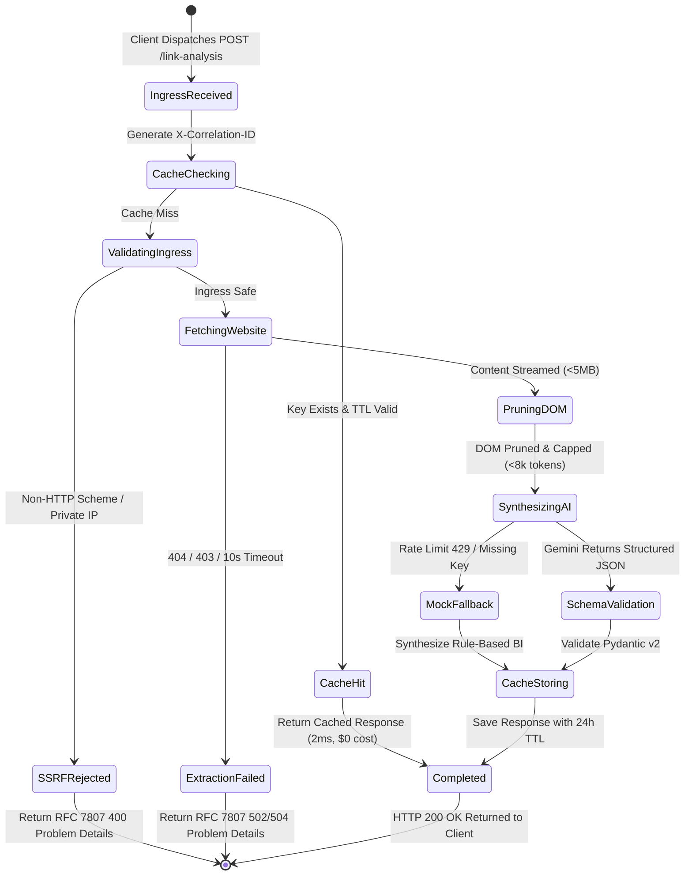

# UML 09: State Diagram - Analysis Request Lifecycle

```mermaid
stateDiagram-v2
    [*] --> IngressReceived: Client Dispatches POST /link-analysis
    IngressReceived --> CacheChecking: Generate X-Correlation-ID
    CacheChecking --> CacheHit: Key Exists & TTL Valid
    CacheHit --> Completed: Return Cached Response (2ms, $0 cost)

    CacheChecking --> ValidatingIngress: Cache Miss
    ValidatingIngress --> SSRFRejected: Non-HTTP Scheme / Private IP
    SSRFRejected --> [*]: Return RFC 7807 400 Problem Details

    ValidatingIngress --> FetchingWebsite: Ingress Safe
    FetchingWebsite --> ExtractionFailed: 404 / 403 / 10s Timeout
    ExtractionFailed --> [*]: Return RFC 7807 502/504 Problem Details

    FetchingWebsite --> PruningDOM: Content Streamed (<5MB)
    PruningDOM --> SynthesizingAI: DOM Pruned & Capped (<8k tokens)
    SynthesizingAI --> MockFallback: Rate Limit 429 / Missing Key
    SynthesizingAI --> SchemaValidation: Gemini Returns Structured JSON

    MockFallback --> CacheStoring: Synthesize Rule-Based BI
    SchemaValidation --> CacheStoring: Validate Pydantic v2
    CacheStoring --> Completed: Save Response with 24h TTL
    Completed --> [*]: HTTP 200 OK Returned to Client
```
