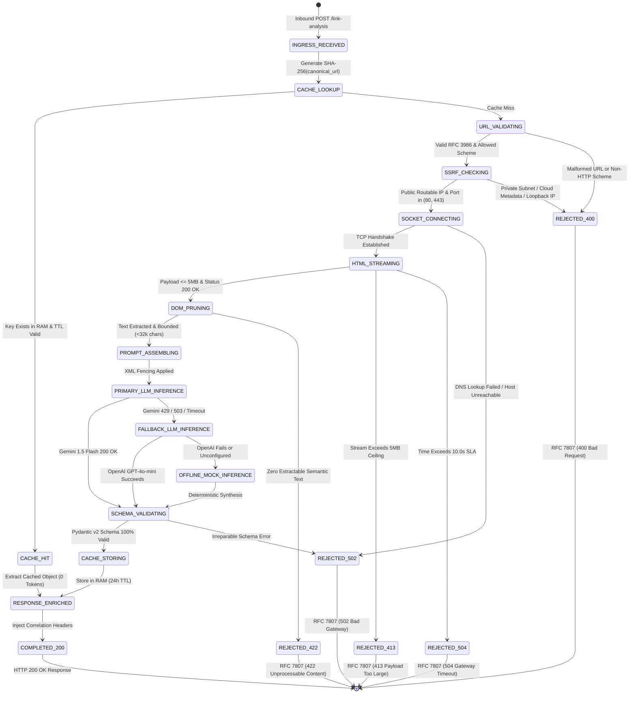

# UML 09: State Diagram - Microservice Request Lifecycle Finite State Machine (FSM)

```mermaid
stateDiagram-v2
    [*] --> INGRESS_RECEIVED: Inbound POST /link-analysis
    
    INGRESS_RECEIVED --> CACHE_LOOKUP: Generate SHA-256(canonical_url)
    
    CACHE_LOOKUP --> CACHE_HIT: Key Exists in RAM & TTL Valid
    CACHE_HIT --> RESPONSE_ENRICHED: Extract Cached Object (0 Tokens)
    
    CACHE_LOOKUP --> URL_VALIDATING: Cache Miss
    URL_VALIDATING --> SSRF_CHECKING: Valid RFC 3986 & Allowed Scheme
    URL_VALIDATING --> REJECTED_400: Malformed URL or Non-HTTP Scheme
    
    SSRF_CHECKING --> SOCKET_CONNECTING: Public Routable IP & Port in (80, 443)
    SSRF_CHECKING --> REJECTED_400: Private Subnet / Cloud Metadata / Loopback IP
    
    SOCKET_CONNECTING --> HTML_STREAMING: TCP Handshake Established
    SOCKET_CONNECTING --> REJECTED_502: DNS Lookup Failed / Host Unreachable
    
    HTML_STREAMING --> DOM_PRUNING: Payload <= 5MB & Status 200 OK
    HTML_STREAMING --> REJECTED_413: Stream Exceeds 5MB Ceiling
    HTML_STREAMING --> REJECTED_504: Time Exceeds 10.0s SLA
    
    DOM_PRUNING --> PROMPT_ASSEMBLING: Text Extracted & Bounded (<32k chars)
    DOM_PRUNING --> REJECTED_422: Zero Extractable Semantic Text
    
    PROMPT_ASSEMBLING --> PRIMARY_LLM_INFERENCE: XML Fencing Applied
    
    PRIMARY_LLM_INFERENCE --> SCHEMA_VALIDATING: Gemini 1.5 Flash 200 OK
    PRIMARY_LLM_INFERENCE --> FALLBACK_LLM_INFERENCE: Gemini 429 / 503 / Timeout
    
    FALLBACK_LLM_INFERENCE --> SCHEMA_VALIDATING: OpenAI GPT-4o-mini Succeeds
    FALLBACK_LLM_INFERENCE --> OFFLINE_MOCK_INFERENCE: OpenAI Fails or Unconfigured
    
    OFFLINE_MOCK_INFERENCE --> SCHEMA_VALIDATING: Deterministic Synthesis
    
    SCHEMA_VALIDATING --> CACHE_STORING: Pydantic v2 Schema 100% Valid
    SCHEMA_VALIDATING --> REJECTED_502: Irreparable Schema Error
    
    CACHE_STORING --> RESPONSE_ENRICHED: Store in RAM (24h TTL)
    RESPONSE_ENRICHED --> COMPLETED_200: Inject Correlation Headers
    
    COMPLETED_200 --> [*]: HTTP 200 OK Response
    
    REJECTED_400 --> [*]: RFC 7807 (400 Bad Request)
    REJECTED_413 --> [*]: RFC 7807 (413 Payload Too Large)
    REJECTED_422 --> [*]: RFC 7807 (422 Unprocessable Content)
    REJECTED_502 --> [*]: RFC 7807 (502 Bad Gateway)
    REJECTED_504 --> [*]: RFC 7807 (504 Gateway Timeout)
```
