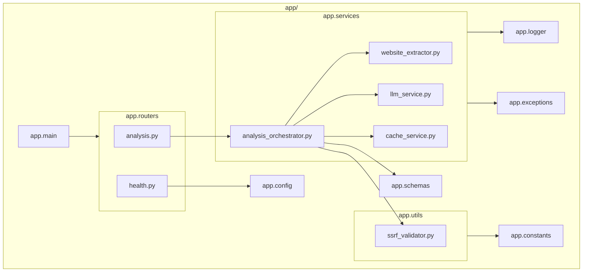

# UML 10: Package Diagram

```mermaid
graph TD
    subgraph AppPackage["app/"]
        Main["app.main"]
        Config["app.config"]
        Constants["app.constants"]
        Exceptions["app.exceptions"]
        Logger["app.logger"]
        Schemas["app.schemas"]

        subgraph Routers["app.routers"]
            AnalysisRouter["analysis.py"]
            HealthRouter["health.py"]
        end

        subgraph Services["app.services"]
            Extractor["website_extractor.py"]
            LLMService["llm_service.py"]
            Orchestrator["analysis_orchestrator.py"]
            Cache["cache_service.py"]
        end

        subgraph Utils["app.utils"]
            SSRF["ssrf_validator.py"]
        end
    end

    Main --> Routers
    AnalysisRouter --> Orchestrator
    HealthRouter --> Config
    Orchestrator --> Extractor
    Orchestrator --> LLMService
    Orchestrator --> Cache
    Orchestrator --> SSRF
    Orchestrator --> Schemas
    Services --> Logger
    Services --> Exceptions
    Utils --> Constants
```
