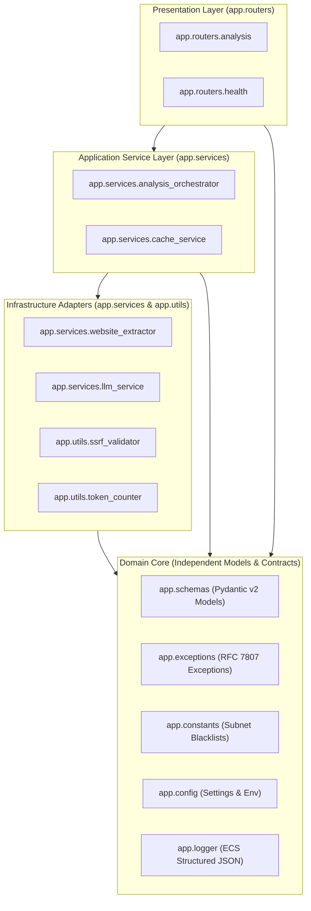

# UML 10: Package Diagram - Clean Architecture Dependencies

```mermaid
graph TD
    subgraph PresentationLayer["Presentation Layer (app.routers)"]
        AnalysisRouter["app.routers.analysis"]
        HealthRouter["app.routers.health"]
    end

    subgraph ApplicationLayer["Application Service Layer (app.services)"]
        Orchestrator["app.services.analysis_orchestrator"]
        CacheService["app.services.cache_service"]
    end

    subgraph InfrastructureLayer["Infrastructure Adapters (app.services & app.utils)"]
        Extractor["app.services.website_extractor"]
        LLMService["app.services.llm_service"]
        SSRF["app.utils.ssrf_validator"]
        Telemetry["app.utils.token_counter"]
    end

    subgraph DomainCore["Domain Core (Independent Models & Contracts)"]
        Schemas["app.schemas (Pydantic v2 Models)"]
        Exceptions["app.exceptions (RFC 7807 Exceptions)"]
        Constants["app.constants (Subnet Blacklists)"]
        Config["app.config (Settings & Env)"]
        Logger["app.logger (ECS Structured JSON)"]
    end

    PresentationLayer --> ApplicationLayer
    ApplicationLayer --> InfrastructureLayer
    InfrastructureLayer --> DomainCore
    ApplicationLayer --> DomainCore
    PresentationLayer --> DomainCore
```
