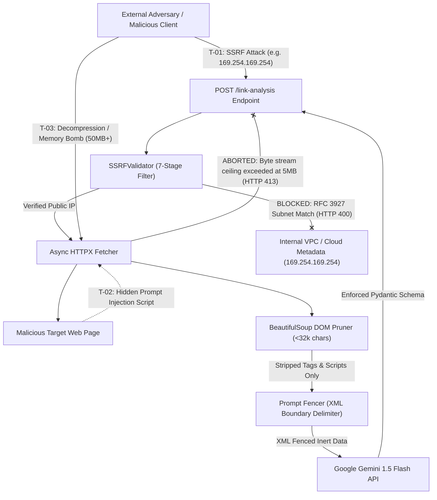

# UML 12: Security Threat & Data Flow Diagram (STRIDE Mitigations)

```mermaid
graph TD
    Attacker["External Adversary / Malicious Client"]
    Ingress["POST /link-analysis Endpoint"]
    SSRF["SSRFValidator (7-Stage Filter)"]
    HTTPX["Async HTTPX Fetcher"]
    TargetSite["Malicious Target Web Page"]
    DOMPrune["BeautifulSoup DOM Pruner (<32k chars)"]
    PromptFencer["Prompt Fencer (XML Boundary Delimiter)"]
    LLM["Google Gemini 1.5 Flash API"]
    PrivateVPC["Internal VPC / Cloud Metadata (169.254.169.254)"]

    Attacker -->|"T-01: SSRF Attack (e.g. 169.254.169.254)"| Ingress
    Ingress --> SSRF
    SSRF --x|"BLOCKED: RFC 3927 Subnet Match (HTTP 400)"| PrivateVPC
    SSRF -->|"Verified Public IP"| HTTPX
    
    Attacker -->|"T-03: Decompression / Memory Bomb (50MB+)"| HTTPX
    HTTPX --x|"ABORTED: Byte stream ceiling exceeded at 5MB (HTTP 413)"| Ingress
    
    HTTPX --> TargetSite
    TargetSite -.->|"T-02: Hidden Prompt Injection Script"| HTTPX
    HTTPX --> DOMPrune
    DOMPrune -->|"Stripped Tags & Scripts Only"| PromptFencer
    PromptFencer -->|"XML Fenced Inert Data"| LLM
    LLM -->|"Enforced Pydantic Schema"| Ingress
```
