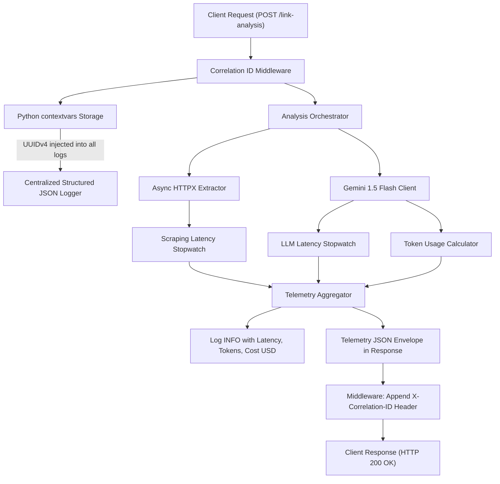

# UML 13: Observability & Telemetry Flow Diagram

```mermaid
graph TD
    Client["Client Request (POST /link-analysis)"] --> MW["Correlation ID Middleware"]
    MW --> Context["Python contextvars Storage"]
    Context -->|"UUIDv4 injected into all logs"| Logger["Centralized Structured JSON Logger"]
    
    MW --> Orchestrator["Analysis Orchestrator"]
    Orchestrator --> Extractor["Async HTTPX Extractor"]
    Extractor --> Timer1["Scraping Latency Stopwatch"]
    
    Orchestrator --> LLM["Gemini 1.5 Flash Client"]
    LLM --> Timer2["LLM Latency Stopwatch"]
    LLM --> TokenCalc["Token Usage Calculator"]
    
    Timer1 --> Telemetry["Telemetry Aggregator"]
    Timer2 --> Telemetry
    TokenCalc --> Telemetry
    
    Telemetry --> LogEmit["Log INFO with Latency, Tokens, Cost USD"]
    Telemetry --> Response["Telemetry JSON Envelope in Response"]
    Response --> MWOut["Middleware: Append X-Correlation-ID Header"]
    MWOut --> ClientOut["Client Response (HTTP 200 OK)"]
```
