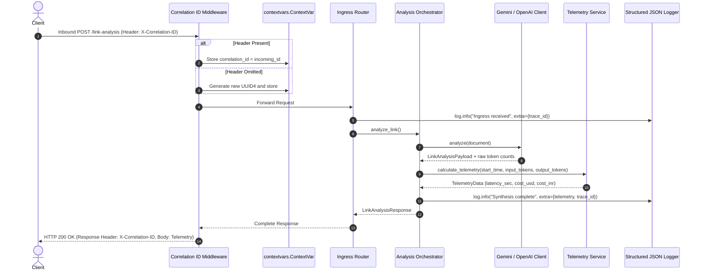

# UML 13: Observability & Telemetry Data Flow

```mermaid
sequenceDiagram
    autonumber
    actor Client
    participant MW as Correlation ID Middleware
    participant Context as contextvars.ContextVar
    participant Router as Ingress Router
    participant Orch as Analysis Orchestrator
    participant LLM as Gemini / OpenAI Client
    participant Telemetry as Telemetry Service
    participant Logger as Structured JSON Logger

    Client->>MW: Inbound POST /link-analysis (Header: X-Correlation-ID)
    alt Header Present
        MW->>Context: Store correlation_id = incoming_id
    else Header Omitted
        MW->>Context: Generate new UUID4 and store
    end
    MW->>Router: Forward Request
    Router->>Logger: log.info("Ingress received", extra={trace_id})
    Router->>Orch: analyze_link()
    Orch->>LLM: analyze(document)
    LLM-->>Orch: LinkAnalysisPayload + raw token counts
    Orch->>Telemetry: calculate_telemetry(start_time, input_tokens, output_tokens)
    Telemetry-->>Orch: TelemetryData (latency_sec, cost_usd, cost_inr)
    Orch->>Logger: log.info("Synthesis complete", extra={telemetry, trace_id})
    Orch-->>Router: LinkAnalysisResponse
    Router-->>MW: Complete Response
    MW-->>Client: HTTP 200 OK (Response Header: X-Correlation-ID, Body: Telemetry)
```
